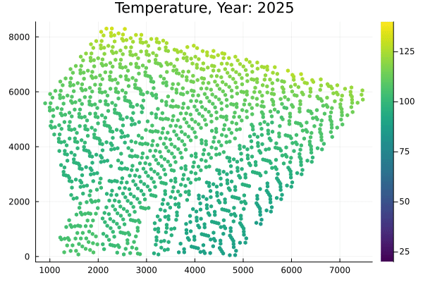

# GeothermalMDP

By: [lanasaad](https://github.com/lanasaad), [mansurarief](https://github.com/mansurarief), and [mykelk](https://github.com/mykelk).

This repo contains a simplified MDP model for Geothermal reservoir planning and exploration. Given an estimated temperature across points in a reservoir, how to determine the optimal sequence of well pairs to drill (injector, producer) to optimize Geothermal energy harvested (and thus the NPV) in the long-run.




## Example

```julia
using POMDPTools
using Random

include("src/pomdp.jl")
include("src/policy.jl")
include("src/utils.jl")

rng = MersenneTwister(1)
mdp = GeothermalMDP()

# random policy
policy = BuildRandom(mdp)
hr = HistoryRecorder(max_steps=30)
@time rhist = simulate(hr, mdp, policy);
```


## Data

Place your reservoir model `reservoir.csv` in the `data` dir